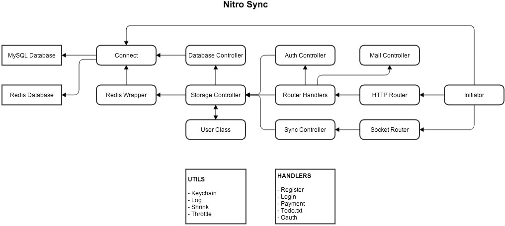

# Nitro Sync 2.1 #

## Requirements ##
- Node.js and NPM
- Coffeescript
- Microsoft SQL Server or MySQL Server

## To install and run ##
- `npm install` to install the dependencies
- `coffee app/init.coffee` to run the app

## To start in debug mode ##
- Enables logging
- Sends registration tokens directly back to user instead of by email (Check browser console when registering)
- `coffee app/init.coffee --debug`

## To test ##
- `npm test` - to test everything
- `mocha --compilers coffee:coffee-script test/<filename>.coffee` - to test
  only some things.

# About Nitro Sync

## Module Layout

## Storage

All data is stored in a SQL database

Data stored on SQL includes

- All user data
    - ID
    - Name
    - Email
    - Password (bcrypt hash)
    - Task data
    - List data
    - Task and list timestamps (for merging data)
    - Creation timestamp of user account
    - Timestamp of last change to user account
- Login Tokens
- Registration Tokens
- Password Reset Tokens

## Websockets

We use WebSockets (via Socket.IO) to connect to the Nitro client and sync data
in real time.

## Security

Nitro Sync uses node-bcrypt to hash passwords.

All other data is stored unencrypted in the database.

## Privacy

Nitro Sync does not share your data with anyone else.

## Analytics

Nitro Sync does collect analytics, but only very limited data to give us an
idea of how many people use the service.

The only data we track is how many times a user opens the Nitro application.
The login/authentication process stores a record of who logged in and the
current time.

We respect your privacy and there is an option in the Nitro settings panel to
opt out of analytics.

_Nitro Sync Analytics and the opt out feature are both under work and are not
yet implemented._

